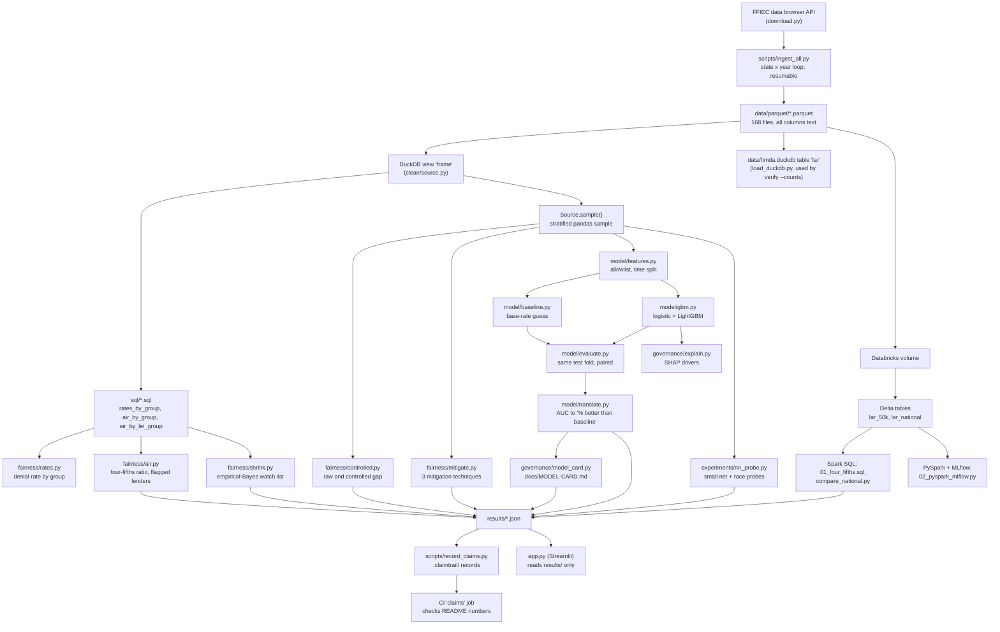
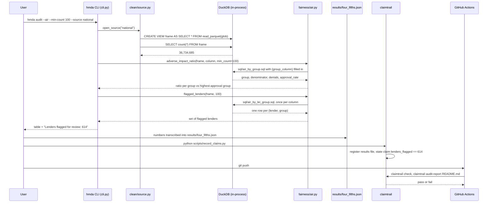

# How it works

This document explains the whole pipeline from raw files to the numbers in
the README, one stage at a time. It assumes no prior knowledge of DuckDB,
fair-lending screens or the models. Every claim points to a file and line,
a key in a `results/*.json` file, or a command with its output. Where two
sources in the repo disagree, both are shown.

No lender is named anywhere in this document. Lender identities stay in
local, gitignored files (`src/hmda/fairness/air.py:152-154`,
`src/hmda/fairness/shrink.py:29-30`, `scripts/watch_list.py:7-9`).

## Contents

1. What the audit does
2. The HMDA data
3. Architecture
4. One run, end to end
5. DuckDB from zero
6. The SQL files, line by line
7. The four-fifths screen
8. The controlled gap
9. The models
10. The empirical-Bayes watch list
11. Mitigation and explainability
12. The Databricks port and the parity check
13. The neural-net race probe
14. How README numbers are checked in CI
15. Open conflicts in the repo
16. Limits
17. Glossary

## 1. What the audit does

1. It loads 36,734,685 public US mortgage applications (2023 to 2025, 5,329
   lenders) and, for each lender and for the country as a whole, compares
   how often each race, ethnicity and sex group gets approved.
2. It then asks how much of each raw gap is left after adjusting for a few
   credit factors, and which lenders' gaps are too large to be explained by
   small-sample noise.
3. It trains denial-prediction models that never see race, ethnicity, sex
   or age, measures how well they rank applications against a trivial
   baseline, and documents the models the way a model-risk team would.

Sources: `results/scale.json` keys `applications`, `lenders`, `years`,
from `hmda verify --counts`, which reads `data/hmda.duckdb` directly:

```
$ .venv/bin/hmda verify --counts
year 2023: 11318595 rows
year 2024: 12043253 rows
year 2025: 13372837 rows
total rows: 36734685
distinct lei: 5329
```

## 2. The HMDA data

HMDA (the Home Mortgage Disclosure Act) requires most US mortgage lenders to
report every application they receive. The public file is the
Loan/Application Register (LAR), one row per application. This repo
downloads it per state and year from the FFIEC data browser API
(`src/hmda/ingest/download.py:3-9`, `:25`).

The file has 99 columns (`len(con.execute("select * from frame limit 0").description)` returns 99 on the local view). Every column is loaded
as text, on purpose, because the data's traps are string-level problems
("NA", "Exempt", "80" and "80.0" in the same column) and casting at load
time would hide them (`src/hmda/ingest/load_duckdb.py:26-31`).

### Fields used

| Field | Used for | Source |
|---|---|---|
| `action_taken` | the outcome (denied or not) | `src/hmda/clean/__init__.py:21` |
| `derived_race`, `derived_ethnicity`, `derived_sex` | grouping only, never a model input | `src/hmda/fairness/rates.py:28-30` |
| `lei` | the lender identifier (Legal Entity Identifier) | `sql/air_by_lei_group.sql:13` |
| `activity_year` | the time-based train/test split | `src/hmda/model/features.py:370-388` |
| `income` | control and feature; reported in thousands of dollars | `src/hmda/model/features.py:248-249` |
| `loan_to_value_ratio`, `debt_to_income_ratio`, `loan_purpose`, `lien_status` | controls in the controlled gap | `src/hmda/fairness/controlled.py:85-91` |
| 16 loan and property columns | model features | `src/hmda/model/features.py:151-168` |

The CFPB field reference
(https://ffiec.cfpb.gov/documentation/publications/loan-level-datasets/lar-data-fields)
describes `derived_race` as a "single aggregated race categorization derived
from applicant/borrower and co-applicant/co-borrower race fields". The
"Joint" group comes out of that derivation, from combining the applicant's
and co-applicant's race fields. The exact derivation rule is not reproduced
in this repo.

### `action_taken` codes

Labels are from the CFPB field reference above. Counts are from the local
national file:

```
$ .venv/bin/python -c "import duckdb; con=duckdb.connect(); \
  con.execute(\"create view frame as select * from read_parquet('data/parquet/*.parquet')\"); \
  print(con.execute('select action_taken, count(*) from frame group by 1 order by 1').fetchall())"
[('1', 18720451), ('2', 1062793), ('3', 6166654), ('4', 4692458),
 ('5', 1802613), ('6', 4113896), ('7', 36744), ('8', 139076)]
```

| Code | Meaning | Rows |
|---|---|---|
| 1 | Loan originated | 18,720,451 |
| 2 | Application approved but not accepted | 1,062,793 |
| 3 | Application denied | 6,166,654 |
| 4 | Application withdrawn by applicant | 4,692,458 |
| 5 | File closed for incompleteness | 1,802,613 |
| 6 | Purchased loan | 4,113,896 |
| 7 | Preapproval request denied | 36,744 |
| 8 | Preapproval request approved but not accepted | 139,076 |

### Why code 6 is excluded

A purchased loan is a loan the reporting institution bought from someone
else. Nobody applied to that institution and it made no approve-or-deny
decision, so counting it would inflate the "not denied" side of every rate
(`src/hmda/clean/filters.py:65-77`, `databricks/01_four_fifths.sql:15`).
36,734,685 minus 4,113,896 purchased loans gives the 32,620,789 rows
screened (`results/four_fifths.json` key `rows_screened`).

### Two definitions of "approved" in this repo

This matters and is easy to miss.

- **The four-fifths screen** defines approval rate as `1 - denials / count`
  over every code except 6 (`sql/air_by_group.sql:15,17`). Withdrawn
  applications (4), incomplete files (5) and preapproval codes (7, 8) all
  count as "not denied".
- **The models** keep only codes 1, 2 and 3, because 4, 5, 7 and 8 are not
  a lender decision (`src/hmda/model/features.py:196-205`).

The choice moves the national ratio. Using codes 1, 2 and 3 only:

```
$ (DuckDB, same view as above)
select derived_race, count(*), sum((action_taken='3')::int),
       1 - sum((action_taken='3')::int)/count(*)
from frame where action_taken in ('1','2','3')
  and derived_race in ('White','Black or African American','Joint') group by 1
Black or African American  2,233,518  815,053  0.6351
White                     16,739,337 3,576,956  0.7863
Joint                        564,711   108,563  0.8078
```

Black vs Joint is 0.8497 under the screen's definition
(`results/four_fifths.json`) and 0.6351 / 0.8078 = 0.786 under the
decision-only definition. The first is above 0.8 and the second is below
it. The committed result uses the first definition. This is an observation
from one query, not a re-run of the screen.

## 3. Architecture



Two paths leave the parquet files, and the split is deliberate
(`src/hmda/clean/source.py:26-32`):

- **Aggregation paths** (rates, four-fifths, watch list) run SQL over the
  whole file without loading it into memory.
- **Model paths** (controlled gap, models, mitigation, SHAP, the probe) need
  a pandas DataFrame, so they take a stratified sample and must print its
  size.

`app.py` reads only the committed JSON under `results/` and never opens the
data (`app.py:1-12`, `:42-50`).

## 4. One run, end to end

This follows the four-fifths number ("614 lenders flagged", `results/four_fifths.json`)
from raw files to the README check.



Locators for each step: view creation `src/hmda/clean/source.py:79-92`; row
count `src/hmda/clean/source.py:232-241`; CLI branch `src/hmda/cli.py:267-283`;
ratio logic `src/hmda/fairness/air.py:62-146`; lender loop
`src/hmda/fairness/air.py:149-177`; the result
`results/four_fifths.json` (its `command` key names the run, and its
`superseded` key records the earlier 615); the claim `hmda-four-fifths` in
`scripts/record_claims.py`; CI `.github/workflows/claims.yml`.

The step "numbers transcribed into results/four_fifths.json" is manual: the
national run's console output was copied into the results file by hand.
CI cannot re-run the national audit (see the comment at the top of
`.github/workflows/claims.yml`).

## 5. DuckDB from zero

### What it is

DuckDB is a SQL database that runs inside your Python process. There is no
server to start and no network hop. `duckdb.connect()` with no argument
opens an empty in-memory database, and you can point SQL straight at
parquet files on disk. The repo uses it that way everywhere on the audit
path (`src/hmda/fairness/rates.py:73`, `:97`).

### Parquet and columnar reads

A CSV stores data row by row. Parquet stores it column by column, in
compressed chunks, with a footer that says where each column's chunks
live. A query that needs 2 columns can read those 2 and skip the other 97.
That skip is called **column projection**.

DuckDB's plan for the benchmark query shows it doing exactly that. From
`EXPLAIN` on `sql/rates_by_group.sql` (run locally):

```
READ_PARQUET
  Projections:
    derived_race
    action_taken
FILTER  (CAST(action_taken AS INTEGER) != 6)
PROJECTION  derived_race, CASE WHEN (CAST(action_taken AS INTEGER) = 3) ...
HASH_GROUP_BY  count_star(), sum(#1)
ORDER_BY  derived_race ASC
```

Two things to read from this plan. First, only 2 of 99 columns are read.
Second, `action_taken` is text in the files, and DuckDB casts it to an
integer to compare with the literals `3` and `6` in the SQL.

### The view trick

Every SQL file queries a table called `frame`. For the 50,000-row test
fixture, `frame` is a registered pandas DataFrame. For the national data it
is a view:

```
CREATE OR REPLACE VIEW frame AS SELECT * FROM read_parquet('data/parquet/*.parquet')
```

A view stores the query, not the rows, so nothing is loaded until a query
runs, and then only the projected columns stream through
(`src/hmda/clean/source.py:11-24`, `:98-110`). The same SQL text serves both
sources.

### The 185x number, and why it is mostly projection

`bench/compare_pandas.py` runs the same denial-rate-by-race computation two
ways over all 168 files (`results/engineering.json`, from
`.venv/bin/python bench/compare_pandas.py`):

```
M3 wall time        : DuckDB 0.13s vs pandas 24.36s (185x)
M4 peak memory       : DuckDB 0.09 GiB vs pandas 10.49 GiB (119x)
TABLES IDENTICAL: True
```

The pandas side is a plain `pd.read_parquet` of every file with no column
list, then `concat`, filter and `groupby` (`bench/compare_pandas.py:16-20`,
`:267`). It reads all 99 columns on purpose. The bench's own docstring
says "a large part of the gap is therefore column projection rather than
aggregation speed" (`bench/compare_pandas.py:22-31`).

A rough check, one run on the same machine: the same pandas computation
with `columns=['derived_race', 'action_taken']` took 4.0 seconds and gave
the same Black or African American counts (2,893,734 applications, 815,053
denials). That is one timing in a separate session, not a benchmark. It
suggests most of the 24-second gap closes once pandas also projects, and
that DuckDB is still about 30x faster (4.0 s against 0.13 s) on what
remains. The fair summary is: DuckDB
was 185x faster at this narrow, aggregation-heavy query, mainly because it
reads only the columns the query needs without being told to.

## 6. The SQL files, line by line

All three files share one safety rule. `{group_column}` is a column name,
and SQL has no safe way to bind a column name as a parameter. So Python
checks it against a three-name allowlist and a regex before it replaces the
placeholder (`src/hmda/fairness/rates.py:28-46`, `:71`). The lender id is a
value, so it is bound with `?` and never pasted into the text
(`src/hmda/fairness/rates.py:76`).

### `sql/rates_by_group.sql`

```sql
select
    {group_column} as group_value,                                  -- line 19: the group
    count(*) as applications,                                       -- line 20: rows in the group
    sum(case when action_taken = 3 then 1 else 0 end) as denials    -- line 21: count code 3
from frame                                                          -- line 22: the view
where action_taken != 6                                             -- line 23: drop purchased loans
  and (? is null or lei = ?)                                        -- line 24: one lender, or all
group by {group_column}                                             -- line 25
order by group_value                                                -- line 26
```

- Line 21 is the counting trick: `case when` turns each row into 1 or 0 and
  `sum` adds them up, so `denials` is the number of code-3 rows.
- Line 24 takes the same value twice. If the caller passes `None`, the
  first test is true and every lender is included (the national number). If
  it passes an id, only that lender's rows pass.
- Lines 10-14 of the file explain why code 6 is excluded here even though
  the caller should already have removed it: the query must be correct on
  raw input too.

### `sql/air_by_group.sql`

Same as above, plus line 15:

```sql
1.0 - (sum(case when action_taken = 3 then 1 else 0 end) * 1.0 / count(*)) as approval_rate
```

The `* 1.0` forces decimal division. Without it, some SQL engines divide two
integers and round down to 0. The file exposes approval rate directly
because the four-fifths rule is defined on approval rates (lines 8-10).

### `sql/air_by_lei_group.sql`

Same aggregation, but grouped by `lei` and the group column together
(lines 12-22), with `lei is not null` (line 20). It returns one row per
(lender, group) in a single scan. The alternative, one query per lender,
would mean thousands of scans (lines 4-6, and
`src/hmda/fairness/air.py:160-164`). The watch list and the Spark parity
check both use this file.

### `databricks/01_four_fifths.sql`

The Spark SQL port. It uses a CTE (`WITH g AS (...)`, line 8) to compute the
group table once, then a scalar subquery
`(SELECT approval_rate FROM g WHERE grp = 'White')` (line 24) to divide by
the reference rate. Two differences from the DuckDB version: it compares
`action_taken` to the strings `'3'` and `'6'` (lines 12, 15), and it
hardcodes White as the reference group (line 24), where `air.py` picks the
highest-approval group.

## 7. The four-fifths screen

### The rule from zero

The four-fifths rule is a screening heuristic that comes from US
employment-selection guidelines (general background, not sourced from this
repo). Here it is used as a simple fairness screen for lending. Divide one
group's selection rate by the rate of the most-favoured group. If the ratio
is below 0.8 (four fifths), flag it for review.

In code:

- ratio = approval_rate(group) / approval_rate(reference)
  (`src/hmda/fairness/air.py:134`)
- flagged if ratio < 0.80 (`src/hmda/fairness/air.py:15`, `:143`)
- the reference is the group with the highest approval rate among groups
  large enough to trust (`src/hmda/fairness/air.py:89-94`)
- if the reference approval rate is 0, every ratio is 0/0. Each eligible
  group gets the string `"UNDEFINED"` and is not flagged
  (`src/hmda/fairness/air.py:116-132`). Until 2026-09-28 this case gave 0.0
  and a flag, so one national lender, whose only group was the reference
  group and who denied every application, was flagged against itself
  (`docs/VERIFICATION.md` section 3)

### Worked example with national numbers

From `results/denial_rates.json`, all years, code 6 excluded:

| Group | Applications | Denials | Denial rate | Approval rate |
|---|---|---|---|---|
| Joint | 702,245 | 108,563 | 0.1546 | 0.8454 |
| White | 20,593,339 | 3,576,956 | 0.1737 | 0.8263 |
| Black or African American | 2,893,734 | 815,053 | 0.2817 | 0.7183 |
| Free Form Text Only | 9,032 | 3,782 | 0.4187 | 0.5813 |

Joint has the highest approval rate, so it is the reference
(`results/four_fifths.json` key `reference_group`: "Joint").

- Black or African American: 0.7183 / 0.8454 = **0.8497**. Not flagged.
  This matches `results/four_fifths.json`.
- Free Form Text Only: 0.5813 / 0.8454 = **0.6876**. Flagged.
- Against White instead of Joint, Black or African American would be
  0.7183 / 0.8263 = 0.8693.

The reference choice matters. "Joint" is not a race; it is a mixed-race
applicant pair. The code picks it because it is the highest-approval group
that clears the floor, not because anyone decided it is the right
comparison.

The only national groups flagged are "Free Form Text Only" for race and
for ethnicity (`results/four_fifths.json` rows with `"flag": true`). For
sex, Female is 0.904 against Joint.

### What "614 lenders flagged" means

`flagged_lenders` loops over all three columns (race, ethnicity, sex). A
lender is counted if **any** group in **any** column falls below 0.8 against
that lender's own reference group (`src/hmda/fairness/air.py:149-177`).
Groups such as "Free Form Text Only" and "Race Not Available" count as
groups. So 614 of 5,329 lenders (`results/four_fifths.json` keys
`lenders_flagged`, `lenders_screened`) had at least one such group, which is
not the same as 614 lenders with a Black vs White gap. (It was 615 before
the 0/0 fix above.)

### A flag is not a finding

The ratio compares raw outcomes. It does not adjust for income, debt, loan
type, or anything else, and HMDA has no credit score. The CLI prints this on
every run: "A flag is a statistical disparity that warrants review, NEVER a
finding of discrimination" (`src/hmda/cli.py:272`, and
`tests/test_disparity_language.py` checks it).

### The `min_count` floor

A group with 13 applications and 6 denials gives a ratio that can swing
wildly with one more denial. So any group below `min_count` rows gets the
string `"SUPPRESSED"` instead of a number, and is never silently dropped
(`src/hmda/fairness/air.py:102-114`, `src/hmda/fairness/floors.py:13-20`).
The reference group must also clear the floor (`air.py:89-93`). The default
is 100 (`floors.py:10`) and the CLI takes `--min-count`. The floor decides
which small groups get a ratio at all. It changes the other groups' ratios
only when it changes which group is the reference, because the reference
must clear the floor too.

## 8. The controlled gap

### The idea from zero

A raw gap says group A is denied more than group B. Part of that may be
because the two groups apply with different incomes, loan sizes or debt
levels. A controlled gap asks: if we compare applicants who look the same
on those factors, how much gap is left?

### The method

`src/hmda/fairness/controlled.py:10-23` states it:

1. Keep only the two groups being compared.
2. Fit a logistic regression: denial ~ group indicator + five controls
   (income, loan-to-value, debt-to-income, loan purpose, lien status;
   `controlled.py:85-91`).
3. For every row, predict the denial probability twice: once with the
   group indicator set to 1, once set to 0, keeping that row's controls.
4. Average the difference over all rows. This is the **average marginal
   effect** (AME), in percentage points (`controlled.py:376-407`).

Logistic regression models the log-odds of denial as a weighted sum of the
inputs. It is used here because the outcome is yes or no. The AME converts
the model's group effect back into a probability difference that people can
read.

Missing numeric controls are filled with the median plus a
`<col>_missing` flag column; categorical controls get a "missing" level
(`controlled.py:225-253`). Debt-to-income buckets become their midpoints
(`controlled.py:47-55`, `:186-216`).

### Stated assumptions (`controlled.py:25-46`)

1. No unmeasured confounder. HMDA has no credit score, so one almost
   certainly remains.
2. Each control's effect is linear in the log-odds, with no interactions.
3. Missing values are not informative within a group.
4. Debt-to-income midpoints are an approximation.

### Worked example

`results/controlled.json`: Black or African American vs Joint, national
stratified sample of 200,000 rows, seed 0.

- raw gap: **+12.44 pp**. Black applicants in the sample were denied 12.44
  percentage points more often than Joint applicants.
- controlled gap: **+8.23 pp**. After the five controls, the model still
  attributes 8.23 points to group membership.

So about a third of the raw gap (4.21 of 12.44 points) is accounted for by
the five controls, and about two thirds is not.

### How to read the 8.23

The docstring calls the controlled gap "a lower bound on how much of the
raw gap survives *these five* controls" (`controlled.py:33-35`). A more
careful reading uses omitted-variable bias. If credit score is lower on
average for one group and lower scores lead to more denials, then leaving it
out pushes some of its effect into the group coefficient. Adding it would
then probably shrink the gap. Under that assumption, 8.23 points is more
likely an overstatement of what would survive a full set of controls than an
understatement. The direction is not measured here, because the data has no
credit score. Either way the output says: "The controlled gap is
unexplained variation under a stated model. It is not evidence of
discrimination" (`src/hmda/cli.py:302`).

The raw and controlled numbers always travel together. The code has no
function that returns only one of them (`controlled.py:1-8`, `:302-305`).

## 9. The models

### Feature allowlist and blocked columns

The model's inputs are an explicit list of 16 loan and property columns
(`src/hmda/model/features.py:151-168`). A column not in the list cannot
become a feature. On top of that:

- Protected columns (race, ethnicity, sex, age, in every raw and derived
  form) are matched by family, not by a short list, because the raw file has
  many variants such as `applicant_race-1` to `-5`
  (`features.py:10-24`, `:71-85`).
- Outcome-leaking columns (denial reasons, interest rate, loan costs, and
  others that only exist after a decision) are blocked
  (`features.py:103-132`).
- Census tract, county and tract minority share are blocked as geographic
  proxies for race (`features.py:138-147`).
- `build_feature_matrix` raises if the allowlist and the block lists ever
  overlap, and again if a protected or leaking column reaches the matrix
  (`features.py:331-334`, `:363-365`).

Why block protected columns: using race to set an applicant's outcome is
disparate treatment on its face in the US (`mitigate.py:21-24` makes the
same point about per-group cut-offs). The audit uses them only after the fact, to group
outcomes. Blocking them does not make the model blind to them, as section
13 shows.

After encoding (one-hot columns, an engineered loan-to-income ratio, and a
debt-to-income rank), the 16 columns become 46 model inputs on the national
sample. From the seed-0 run of
`hmda model --eval --source national --sample-n 1500000 --sample-seed 0`:

```
  rows: 1500000 raw -> 1058400 analysis (purchased and non-decision actions excluded)
  time split at activity_year 2025: 678035 train rows (earlier years) / 380365 test rows (later years), no random shuffle
  features: 46 columns, none of them protected-class
  denial rate: 24.5% train, 22.4% test
```

### Time split

Train on 2023 and 2024, test on 2025, never a random shuffle
(`src/hmda/model/features.py:370-388`, `src/hmda/model/evaluate.py:38`).
This mimics real use: fit on the past, score the future. A random split
would let the model see the test period's conditions during training.

### The base-rate baseline

`BaseRateBaseline` gives every applicant the same score, the training
denial rate (`src/hmda/model/baseline.py:36-49`). Because every score is
equal, it cannot order anyone, and its AUC is exactly 0.5
(`baseline.py:6-17`). It is the floor any model must beat.

### What AUC means

Take one denied application and one approved application at random. AUC is
the probability that the model gives the denied one the higher risk score,
counting a tie as half (`src/hmda/model/translate.py:9-15`). It is a
pair-ordering rate. It says nothing about calibration or about where to set
a cut-off.

### How 57% and 72% are computed

`translate.py:97-108`:

```
P = (auc - baseline_auc) / baseline_auc * 100      with baseline_auc = 0.5
```

On a 1,500,000-row stratified national sample, seeds 0, 1 and 2
(`docs/VERIFICATION.md` section 7, "Recorded model runs"; also
`results/model_eval.json`):

| Model | Pairs ordered correctly (of 100) | % better than baseline |
|---|---|---|
| base-rate baseline | 50 | 0 |
| logistic regression | 78 | 57% |
| LightGBM | 86 | 72% |

The three seeds agreed at the printed precision. The test fold is 2025
(about 380,000 rows) and the training fold 2023 to 2024 (about 680,000
rows), after dropping codes 4 to 8 (the seed-0 output above). These are
sample numbers, not full-file numbers.

Note on the formula: with a 0.5 baseline, (AUC - 0.5) / 0.5 equals
2 x AUC - 1, which is the Gini coefficient used in credit scoring. So "72%
better" is the same number as a Gini of about 0.72, from an AUC of about
0.86. `translate.py:42-43` says the sentence is "not a lift, a capture
rate, or a Gini score"; the wording differs but the arithmetic is the same.

### Logistic regression vs LightGBM

- **Logistic regression** (`src/hmda/model/gbm.py:24-54`) is one weighted
  sum passed through a sigmoid. It needs no missing values, so a pipeline
  imputes medians, adds missing-value flags and standardises, all fitted on
  the training fold only. It is easy to explain but cannot capture
  interactions unless you add them.
- **LightGBM** (`gbm.py:57-81`) is gradient-boosted decision trees: 300
  small trees, each fitting the errors of the ones before it. It handles
  missing values natively and finds interactions and thresholds on its own.
  That is the likely reason it orders more pairs correctly on tabular data
  like this.

Both are seeded (`gbm.py:21`) and trained on the same allowlisted matrix.

## 10. The empirical-Bayes watch list

### The problem

A lender with 12 Black applicants and 4 denials looks as extreme as one with
12,000 and 4,000, but the first number is mostly noise
(`src/hmda/fairness/shrink.py:3-6`). The four-fifths screen handles this
with a hard floor. The watch list handles it with shrinkage.

### The method from zero (`shrink.py:8-24`)

For one comparison, Black or African American vs White
(`scripts/watch_list.py:32`), and every lender with at least 5 applicants
in each group (`shrink.py:42`):

1. **Observed gap.** g = denial rate(Black) - denial rate(White), in
   percentage points (`shrink.py:121`).
2. **Sampling variance with pooled rates.** s^2 = p_g(1 - p_g)/n_g +
   p_r(1 - p_r)/n_r, where p_g and p_r are the denial rates of the two groups
   pooled across all scored lenders (`shrink.py:111-115`, `:122`). Using the
   lender's own rates would give a lender with 0 of 5 denials a variance of
   0 and infinite weight.
3. **DerSimonian-Laird.** Treat each lender's true gap as drawn from
   Normal(mu, tau^2). Estimate mu (the typical gap) and tau^2 (how much true
   gaps vary between lenders) by method of moments: compute a weighted mean,
   measure how much more the gaps spread than their sampling variances would
   explain (the Q statistic), and turn the excess into tau^2
   (`shrink.py:124-132`). No fitting loop, no tuning.
4. **Shrinkage weight.** w = tau^2 / (tau^2 + s^2). A noisy lender (large
   s^2) gets a small w. The posterior mean is w x g + (1 - w) x mu, and the
   posterior variance is w x s^2 (`shrink.py:136-138`).
5. **Posterior probability.** P(true gap > mu) from the normal posterior
   (`shrink.py:139`). A lender is on the watch list if this is at least
   0.95 (`shrink.py:39`).

The threshold is mu, not zero. The watch list means "worse than the typical
lender, with at least 95% posterior probability", not "has a gap".

### Worked example (illustrative numbers, not real lenders)

Using the national mu = 9.84 pp and tau = 5.93 pp, and pooled rates of
about 0.28 and 0.17 (close to the national rates in
`results/denial_rates.json`):

| | Lender A | Lender B |
|---|---|---|
| Black applicants / White applicants | 20 / 200 | 2,000 / 8,000 |
| Observed gap | 25.0 pp | 18.0 pp |
| Standard error, sqrt(s^2) | 10.39 pp | 1.09 pp |
| Weight w | 0.246 | 0.967 |
| Posterior mean | 13.57 pp | 17.73 pp |
| P(true gap > 9.84) | 0.77 | about 1.00 |
| On watch list? | No | Yes |

Lender A has the bigger raw gap but is pulled most of the way back to the
typical lender. Lender B keeps almost its whole gap because its sample is
large.

### National results (`results/watch_list.json`)

| Key | Value |
|---|---|
| `lenders_scored` | 3,454 |
| `typical_gap_pp` (mu) | 9.84 |
| `between_lender_sd_pp` (tau) | 5.93 |
| `watch_list` | 404 |
| `four_fifths_flagged_no_floor` | 1,400 |
| `four_fifths_flagged_min_count_100` | 368 |
| `watch_list_and_four_fifths_no_floor` | 382 |
| `four_fifths_no_floor_not_on_watch_list` | 1,018 |
| `watch_list_not_four_fifths_min_count_100` | 97 |
| `top_n_with_controlled_gap` | 21 |
| `top_n_controlled_gap_still_positive` | 21 |
| `top_n_controlled_not_estimable` | 4 |

Two readings:

- Without a floor, the four-fifths screen flags 1,400 lenders on the Black
  group, and 1,018 of them are not on the watch list. That means they are
  not confidently worse than the typical lender. It does not mean they have
  no gap, and the two screens ask different questions: the four-fifths
  ratio compares approval rates against the lender's own top-approval
  group, while the watch list compares the Black vs White denial gap with
  the typical lender's gap.
- These counts are not the 614 in section 7. The 1,400 and 368 count only
  lenders flagged on the Black or African American group, and only among the
  3,454 scored lenders (`scripts/watch_list.py:35-45`, `:73-75`). The 614
  counts lenders with any group flagged in any of the three columns.
- With the 100 floor, the screen misses 97 watch-list lenders. Recomputed
  from the local, gitignored file (counts only):

```
$ .venv/bin/python -c "import csv; rows=list(csv.DictReader(open('out/watch_list_local_national.csv'))); \
  w=[r for r in rows if r['on_watch_list']=='True']; nf=[r for r in w if r['four_fifths_flag_floor100']=='False']; \
  print(len(nf), sum(int(r['n_black'])<100 for r in nf), sum(int(r['n_black'])>=100 for r in nf))"
97 61 36
```

  So 61 are missed because they have fewer than 100 Black applicants, and 36
  have 100 or more but a ratio of 0.8 or above. For those 36 the ratio is
  against each lender's own highest-approval race group
  (`scripts/watch_list.py:35-45` calls `_air_rows_from_raw`), not
  necessarily White.

For the top 25 watch-list lenders the script also computes the controlled
gap on that lender's own rows (`scripts/watch_list.py:79-93`). 21 were
estimable and all 21 stayed positive; 4 were not estimable because a control
had no usable value. 21 plus 4 equals the script's default `--top 25`
(`scripts/watch_list.py:63`); the results file does not record the `--top`
value used, so that match is an inference.

## 11. Mitigation and explainability

### Mitigation (`src/hmda/fairness/mitigate.py`)

Three techniques, one per stage, compared against the unmitigated LightGBM
model on the same time split (`mitigate.py:1-3`, `:29-34`):

- **Reweighing** (before training): weight each (group, outcome) cell by
  P(group) x P(outcome) / P(group, outcome), so under-represented cells count
  more (`mitigate.py:448-472`).
- **Fairness-constrained GBM** (during training): refit the booster several
  times, moving weight toward groups the current model approves least
  (`mitigate.py:503-521`). Rounds and step are fixed, not tuned
  (`mitigate.py:100-107`).
- **Per-group thresholds** (after training): a separate approval cut-off per
  race (`mitigate.py:353-378`). This is disparate treatment on its face in
  the US and is measured only for completeness (`mitigate.py:21-27`).

On a 1,500,000-row sample across three seeds, per-group thresholds cut the
widest approval gap 55% to 61%, the constrained GBM 10.7% to 11.6%, and
reweighing 0.2% to 3.9% (`results/mitigation.json` key
`gap_reduction_range_pct`). The dollar margin figure is single-seed and
flagged as unreliable in the same file (`uncertainty_note`), so it is not
used here.

### Explainability (`src/hmda/governance/explain.py`)

SHAP assigns each feature a share of each prediction. The repo runs
`shap.TreeExplainer` on the LightGBM model over 2,000 held-out rows
(`explain.py:18-22`, `:50`, `:304`). One-hot columns are summed back into
their parent feature so the report says "loan type", not `loan_type_1`
(`explain.py:23-28`). Race is joined back only to break drivers down by
group, never as an input (`explain.py:29-35`). SHAP output is a governance
artifact; no SHAP magnitude is published as a result
(`results/metrics_ledger.json`, M14 summary).

### Model card and controls

`docs/MODEL-CARD.md` is generated from measured facts and checked by
`hmda verify --card` (`docs/MODEL-CARD.md:1-6`). `docs/CONTROLS.md` maps 38
controls to model-risk expectations (SR 11-7, OSFI E-23); 37 are backed by a
test and 1 is not implemented (`results/governance.json`).

## 12. The Databricks port and the parity check

`databricks/README.md` describes the port. The pieces:

- **Volume**: a file area in Databricks. The parquet files were uploaded to
  `/Volumes/workspace/hmda/raw/` (`databricks/README.md:11`, `:26-27`).
- **Delta table**: parquet files plus a transaction log, so the table has
  versions and safe updates (`databricks/README.md:45`). Two tables:
  `workspace.hmda.lar_50k` and `workspace.hmda.lar_national`.
- **Spark SQL**: `01_four_fifths.sql` on the SQL warehouse.
- **PySpark**: `02_pyspark_mlflow.py` writes the same screen with the
  DataFrame API. `filter` is WHERE, `groupBy` plus `agg` is GROUP BY,
  `withColumn` adds a column (`databricks/README.md:51`,
  `02_pyspark_mlflow.py:30-50`).
- **MLflow**: records each training run's parameters and metrics
  (`02_pyspark_mlflow.py:107-123`).

### What was checked

1. **50,000-row sample, four-fifths.** Spark SQL and PySpark both matched a
   DuckDB answer key for all 9 race groups (`databricks/README.md:20-21`,
   `databricks/spark_sql_out.txt`, the `assert` at
   `02_pyspark_mlflow.py:68`). The answer key uses White as the reference
   and the raw file (`databricks/answer_key_50k.md:3-4`), so it is not the
   same table as the repo's `air.py` output.
2. **50,000-row sample, models.** The notebook runs the repo's own
   `run_eval` on the Delta table. AUC 0.8038 (logistic) and 0.8750
   (LightGBM), equal to the laptop run within 1e-4
   (`databricks/README.md:22`, asserts at `02_pyspark_mlflow.py:129-130`).
3. **National, per-lender counts.** `compare_national.py` runs
   `sql/air_by_lei_group.sql` in Spark SQL on the national Delta table and in
   DuckDB on local parquet, then compares every (lender, race) row
   (`compare_national.py:1-9`, `:62-83`).

`results/spark_parity.json`:

| Key | Spark | DuckDB |
|---|---|---|
| rows (lender, race) | 31,793 | 31,793 |
| total applications | 32,620,789 | 32,620,789 |
| total denials | 6,166,654 | 6,166,654 |
| `only_in_spark` / `only_in_duckdb` / `value_mismatches` | 0 / 0 / 0 | |

The national check compares counts and denials, not ratios. Ratios and the
watch list are computed from those counts, so they follow
(`databricks/README.md:39-40`). The Spark time (20.7 s) includes API
polling (`compare_national.py:43-45`, key `seconds_spark_incl_api`), so it
is not a speed comparison with DuckDB's 0.3 s.

## 13. The neural-net race probe

Source: `experiments/README.md`, `experiments/nn_probe.py`,
`results/nn_probe.json`.

### The question

The models never see race. Can race still be read out of their inputs, or
out of a neural net's hidden layers? If yes, removing the race column does
not make a model race-blind (`experiments/README.md:7`).

### What a linear probe is

A probe is a simple classifier trained to predict a property (here, Black
vs White applicant) from some representation (the inputs, or a hidden
layer's activations). A linear probe is a logistic regression on
standardised values (`nn_probe.py:169-172`). If it scores well on held-out
rows, the property is linearly readable from that representation. A hidden
layer is computed from the inputs, so it cannot hold more race information
than the inputs; the probe measures how easy it is to read out
(`experiments/README.md:9`).

### Design

A 500,000-row stratified sample per seed, 5 seeds, train on 2023-2024 and
test on 2025. The net is inputs, then 64 ReLU units, then 32, then one
output, trained with Adam and early stopping (`nn_probe.py:72-73`,
`:113-123`). Probes are fit on one half of the Black and White test rows
and scored on the other half (`nn_probe.py:236-256`).

### Why the controls matter

- **Random-init layer 2**: the same network with untrained weights. Random
  ReLU layers still pass through information from the inputs, so a probe
  on them sets the level you would get with no learning at all. The trained
  layer is only interesting to the extent it beats this.
- **Shuffled labels**: the race labels are permuted before probing. The
  probe should then score about 0.5. If it scored higher, the probe setup
  itself would be leaking or overfitting.

### Results (mean over 5 seeds, `results/nn_probe.json` key `aggregate`)

| Representation | Linear probe AUC |
|---|---|
| input features | 0.678 |
| hidden layer 1 | 0.673 |
| hidden layer 2 | 0.659 |
| random-init layer 2 (control) | 0.642 |
| shuffled labels (control) | 0.499 |

Denial AUC on 2025: LightGBM 0.859, the net 0.838, logistic 0.784.

What this supports: race is readable from the allowed credit fields at about
0.68 AUC, through property value, income, debt-to-income, loan-to-value and
loan type (`experiments/README.md:59-75`). Training does not make it easier
to read than the raw inputs. What it does not support: any claim about
intent, about a lender, or about legal disparate treatment
(`experiments/README.md:79-84`).

On the net vs LightGBM: 4 of 5 seeds reached their best epoch at 29 or 30
of a 30-epoch cap, so the net was still improving
(`experiments/README.md:57`). The comparison is untuned net vs tuned
trees, on tabular data where boosted trees usually do well.

## 14. How README numbers are checked in CI

Each row of the README results table carries a claimtrail marker, for
example `<!-- ct:hmda-four-fifths -->`. `scripts/record_claims.py`
registers the committed `results/*.json` files in a local `.claimtrail/`
store and states one claim per row of the results table, each checked by a
structured assertion, for example `outputs.lenders_flagged == 614`. The
claims are:

| Claim | What it covers |
|---|---|
| `hmda-scale` | applications, lenders and years in the national file |
| `hmda-four-fifths` | lenders screened and flagged by the four-fifths screen |
| `hmda-controlled` | the raw and controlled denial gap, Black against Joint |
| `hmda-model` | the two models' ranking against a base-rate guess |
| `hmda-watch-list` | the empirical-Bayes watch list, Black against White denial gap |
| `hmda-spark-parity` | the DuckDB against Spark comparison |
| `hmda-independent` | the independent pyarrow reimplementation |
| `hmda-race-probe` | the neural-net race probe |
| `hmda-mutation` | the mutation score of the four-fifths and watch-list code |
| `hmda-engineering` | DuckDB against pandas speed and memory |
| `hmda-governance` | the governance controls and their test backing |
| `hmda-tests` | the most recent full test-suite run |

If a results file changes after it was recorded, registration fails, so a
number cannot move under a sentence without notice.

The `claims` workflow (`.github/workflows/claims.yml`) runs on every push:

1. `python scripts/record_claims.py`: results still match their records.
2. `claimtrail check --paper hmda-audit`: every structured assertion holds.
3. `claimtrail audit-report README.md`: every number in the README results
   table is backed by a claim.
4. `claimtrail verifications --check-chain`: the verification log is
   intact.

CI cannot re-run the 36.7M-row audit, so re-runs are logged by hand with
`claimtrail verify --against` (`docs/CLAIMS.md`). The `test` workflow runs
`make test` separately (`.github/workflows/test.yml`).

## 15. Open conflicts in the repo

These are places where two sources in the repo still disagree, or where a
number has weaker backing than the rest.

- **The national mitigation figures have no console output.** The
  1,500,000-row mitigation runs were made by hand, and only the result
  figures were written down (`docs/VERIFICATION.md` section 7).
  `results/mitigation_conflict.json` records that this gap is unresolved.
- **The Databricks SQL uses White as the reference**
  (`databricks/01_four_fifths.sql:24`). `air.py` uses the highest-approval
  group, which is Joint nationally. The Databricks answer key is therefore
  a different table from the repo's four-fifths output (section 12).
- **The recourse verdict text in the CLI is fixture-era.** It says each
  median is taken over "4 to 29 people per group"
  (`src/hmda/fairness/recourse.py:460`). In the national runs the
  reachable group was 0 to 2,234 people per race group (`docs/RECOURSE.md`
  section 8).
  The mechanism it describes is right; the magnitude is stale.

## 16. Limits

- **No credit score.** HMDA does not include credit scores. Every
  controlled gap leaves out the single largest factor in real underwriting
  (`controlled.py:28-35`).
- **Outcome data only.** The data records what happened, not why, beyond
  optional denial reasons. It cannot show intent.
- **`derived_race` is coarse and derived**, not self-identification
  (`docs/LIMITS.md:9-11`). "Race Not Available" is 26.73% of applications
  (`results/denial_rates.json` key `race_not_available_share_pct`), large
  enough to move any comparison.
- **Sample-based numbers.** The controlled gap (200,000 rows), models and
  mitigation (1,500,000), SHAP (2,000) and the probe (500,000 per seed) are
  sample numbers (`results/metrics_ledger.json`).
- **The four-fifths screen counts withdrawn and incomplete files as "not
  denied"** (section 2). A decision-only definition gives different ratios.
- **No lender is named** and no result is a legal finding about any
  institution (`docs/LIMITS.md:5-8`).
- **Recourse (M13) is unmeasurable**: the per-group results reorder across
  seeds, on the fixture and on a 1,500,000-row national sample
  (`docs/RECOURSE.md` sections 5 and 8, `results/metrics_ledger.json`, M13).

## 17. Glossary

- **AME (average marginal effect)**: the average change in predicted
  probability when one input is switched, holding the others at each row's
  values.
- **AUC**: the probability that a random denied application scores above a
  random approved one. 0.5 is chance, 1.0 is perfect ordering.
- **Base rate**: the share of the training set that was denied.
- **Column projection**: reading only the columns a query needs.
- **CTE**: a named temporary result in SQL (`WITH name AS (...)`).
- **Delta table**: parquet files plus a transaction log, in Databricks.
- **DerSimonian-Laird**: a method-of-moments estimate of the mean and
  between-unit variance in a random-effects model.
- **Disparate impact**: a neutral policy that produces unequal outcomes
  across groups.
- **Disparate treatment**: treating applicants differently because of a
  protected characteristic.
- **Empirical Bayes**: estimating the prior from the data itself, then
  using it to shrink each unit's estimate.
- **Four-fifths rule**: a screen that flags a group whose selection rate is
  below 80% of the most-favoured group's.
- **Gini (in credit scoring)**: 2 x AUC - 1.
- **HMDA / LAR**: the Home Mortgage Disclosure Act and its
  Loan/Application Register.
- **LEI**: Legal Entity Identifier, the lender id.
- **LightGBM**: a gradient-boosted decision tree library.
- **Linear probe**: a linear classifier used to test whether a property can
  be read from a representation.
- **MLflow**: a tool that logs model training runs.
- **Parquet**: a columnar file format.
- **Posterior**: the updated belief about a quantity after seeing the
  data.
- **Shrinkage**: pulling noisy estimates toward a common mean in proportion
  to their noise.
- **SHAP**: a method that splits a prediction into per-feature
  contributions.
- **View**: a stored query that behaves like a table.
